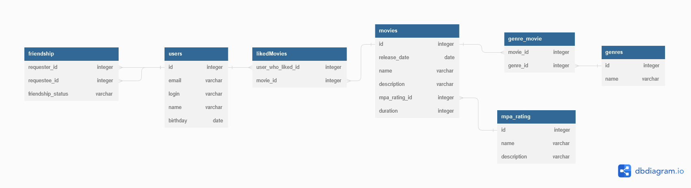

# Filmorate
Cервис оценки фильмов с возможностью вывода ТОПа фильмов и дружбы
пользователей

Стек: REST-сервис с использованием Spring Boot, Maven, Lombok и взаимодействие с БД (H2) с
помощью JDBC.

DB scheme



Query examples:

1) Get all friends
```
SELECT *
FROM users
WHERE id IN (SELECT requester_id
             FROM friendship
             WHERE requestee_id = :user_id
             UNION
             SELECT requestee_id
             FROM friendship
             WHERE requester_id = :user_id AND friendship_status = 'Confirmed');
```

2) Get common friends
```
SELECT *
FROM users
WHERE id IN (SELECT requester_id
             FROM friendship
             WHERE requestee_id = :user_id
             UNION
             SELECT requestee_id
             FROM friendship
             WHERE requester_id = :user_id AND friendship_status = 'Confirmed')
AND id IN (SELECT requester_id
             FROM friendship
             WHERE requestee_id = :another_user_id
             UNION
             SELECT requestee_id
             FROM friendship
             WHERE requester_id = :another_user_id AND friendship_status = 'Confirmed');
```
3) Get most popular films
```
SELECT id, release_date, name, description, mpa_rating_id, duration
FROM movies AS m
RIGHT JOIN likedMovies AS lm ON m.id = lm.movie_id
GROUP BY m.id
ORDER BY COUNT(lm.user_id) DESC
LIMIT :limit;
```
